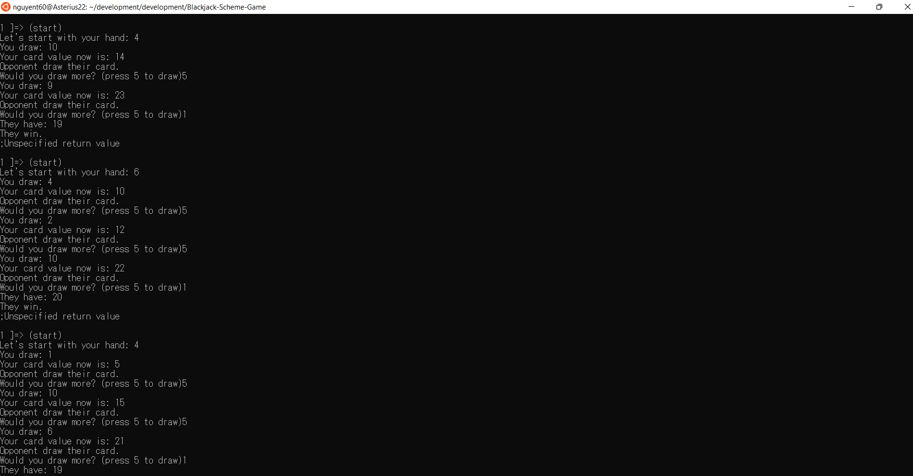

# Python Programming Game - Blackjack

## Description
This is a blackjack game where you will draw cards until there is 21 or more. The highest winnable value is 21 and anymore will result in a bust. Your opponents will be other bot players. You simply start the game and press the prompt key to hit cards and to stand and wait for others. If your card is higher than theirs, you win. 

## Instruction
- To start the game, simply launch the program and run through ubuntu/terminal
- It will print out the intro page 
- You can start the game by pressing s
- The game will draw a card for you, you can hit more cards by pressing d
- You can stand your turn by pressing c
- When everyone finishing drawing, you will see their cards and the game will determine who wins
- You can restart by entering s again 
- You can press x at anytime to quit the game

